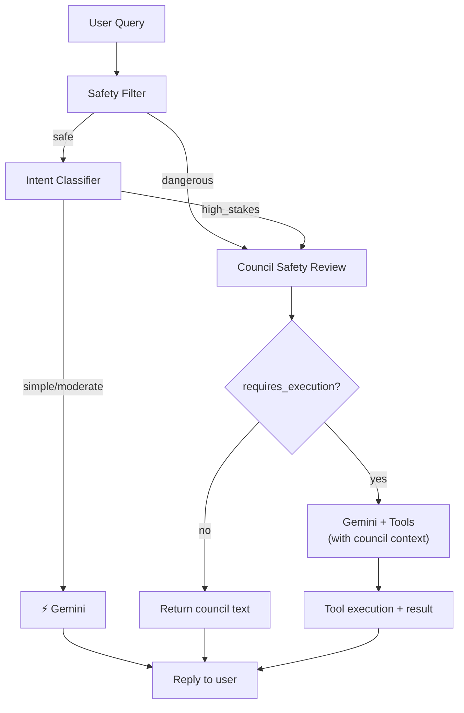

# Post-Intent Routing: Architecture Overhaul

Council becomes the **decision engine**. Gemini becomes the **executor**.



---

## Proposed Changes

### 1. Council → Gemini Execution Pipeline

#### [MODIFY] [server.js](file:///C:/Users/Chaitanya.Kalra/github/consensus-forge/council_provider/server.js) — Router

When the router sends a query to council and gets a response:

**Before**: Return council text directly as SSE → user
**After**: Inject council response into the Gemini messages as a system message, then call Gemini with the original tools so it can execute:

```javascript
// After council responds:
const councilContext = cleanBody.messages.concat([{
    role: 'system',
    content: `The council of AI models has analyzed this request and produced the following response:\n\n${council.response}\n\nUse this council analysis as your basis. If the user's request requires any tool execution (file creation, shell commands, etc.), perform those actions now using the available tools. Present the council's analysis to the user along with any execution results.`
}]);
// Call Gemini with the original tools + council context
const gemini = await callGemini({ ...cleanBody, messages: councilContext }, apiKey);
```

This ensures: council thinks → Gemini executes → tools run → user sees result.

---

### 2. Clean Query Before Council

#### [MODIFY] [server.js](file:///C:/Users/Chaitanya.Kalra/github/consensus-forge/council_provider/server.js) — [extractLastUserMessage()](file:///c:/Users/Chaitanya.Kalra/github/consensus-forge/council_provider/server.js#251-268)

Strip OpenClaw metadata. Current input looks like:
```
Conversation info (untrusted metadata):
```json
{"message_id":"91","sender":"1651967954"}
```

use the council to generate 10 AI startup ideas
```

Add a cleaning function:
```javascript
function cleanUserMessage(text) {
    return text.replace(/^Conversation info \(untrusted metadata\):[\s\S]*?```\s*/m, '').trim();
}
```

---

### 3. Council Model Reliability

#### [MODIFY] [config.py](file:///C:/Users/Chaitanya.Kalra/github/consensus-forge/backend/config.py)

Replace broken models and add timeout:

```python
COUNCIL_MODELS = [
    "google/gemma-3-27b-it:free",        # Google's Gemma 3 (reliable)
    "mistralai/mistral-small-3.1-24b-instruct:free",  # Mistral Small
    "qwen/qwen3-14b:free",               # Qwen 3
    "deepseek/deepseek-r1-0528:free",     # DeepSeek R1
]

CHAIRMAN_MODEL = "google/gemma-3-27b-it:free"

# Per-model timeout
MODEL_TIMEOUT_SECONDS = 15
```

> [!NOTE]
> `tngtech/deepseek-r1t2-chimera:free` returns 404 consistently. `openrouter/free` times out. Both replaced with models known to be available on OpenRouter free tier.

---

### 4. Dangerous Command Flow

#### [MODIFY] [server.js](file:///C:/Users/Chaitanya.Kalra/github/consensus-forge/council_provider/server.js) — Safety filter section

Change from: `dangerous → council → return text`
To: `dangerous → council review → Gemini executes with council context`

Same execution pipeline as #1 but with a `🛡️ Safety Review` prefix.

---

### 5. Structured Council Output

#### [MODIFY] [server.js](file:///C:/Users/Chaitanya.Kalra/github/consensus-forge/council_provider/server.js) — `/v1/council` endpoint

Add structured fields to the council response:

```json
{
    "success": true,
    "response": "...",
    "structured": {
        "type": "analysis|recommendation|safety_review",
        "confidence": 0.85,
        "requires_execution": true
    },
    "models_used": 3,
    "duration_seconds": 45.2
}
```

Detection logic for `requires_execution`:
- Keywords in user query: `save`, `create`, [write](file:///C:/Users/Chaitanya.Kalra/AppData/Roaming/npm/node_modules/openclaw/extensions/phone-control/index.ts#145-157), [run](file:///c:/Users/Chaitanya.Kalra/github/consensus-forge/openclaw-bridge/call_council.js#11-104), `execute`, `make`, [build](file:///c:/Users/Chaitanya.Kalra/github/consensus-forge/council_provider/server.js#67-83), [send](file:///c:/Users/Chaitanya.Kalra/github/consensus-forge/council_provider/server.js#196-220)
- Keywords in council response: `should create`, `recommend creating`, `save to`

Detection for `type`:
- Safety filter triggered → `"safety_review"`
- Query contains decision words → `"recommendation"`
- Default → `"analysis"`

---

### 6. Decision Logging

#### [MODIFY] [server.js](file:///C:/Users/Chaitanya.Kalra/github/consensus-forge/council_provider/server.js)

Add a `logDecision()` function that appends JSON lines to `data/decisions.log`:

```json
{
    "timestamp": "2026-03-09T12:30:00Z",
    "query": "Should I invest in NIFTY 50?",
    "safety_triggered": false,
    "intent": "high_stakes",
    "route": "council",
    "council_response_length": 1200,
    "council_models": 3,
    "council_duration_s": 45.2,
    "requires_execution": false,
    "gemini_executed": false
}
```

---

## Verification Plan

### Via Telegram
1. **"hello"** → `simple` → Gemini only (~1-2s)
2. **"Should I invest in NIFTY 50?"** → `high_stakes` → council → text reply (no execution needed)
3. **"Use the council to generate 10 startup ideas and save to startups.txt"** → council → `requires_execution: true` → Gemini writes file → confirmation
4. **"Write a bash script to clean temp files"** → safety filter → council review → Gemini executes (if approved)
5. Check `data/decisions.log` for routing records
