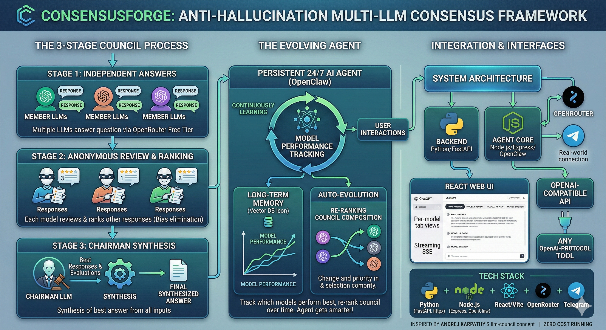
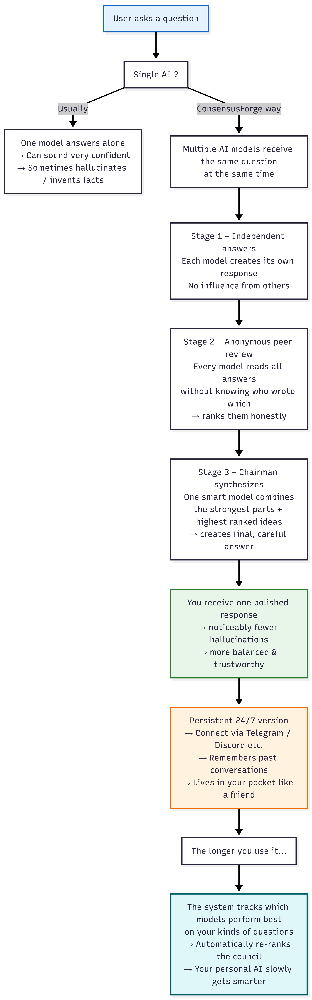

# ConsensusForge

[](https://opensource.org/licenses/MIT)
[]()
[]()
[](https://nodejs.org/)
[](https://python.org/)
[]()

> 🏛️ **An open-source framework that combines persistent, autonomous AI agents with an evolving multi-LLM consensus mechanism — reducing hallucinations, improving reliability, and getting smarter the longer it runs.**



---

## ✨ Features

- 🧠 **Multi-LLM Council** — Queries are sent to multiple LLMs simultaneously. Each model responds independently, reviews & ranks peers anonymously, and a **Chairman LLM** synthesizes the best final answer.
- 🔄 **Automatic Evolution** — The system tracks which models perform best for which tasks and **automatically re-ranks the council** over time. Your agent literally gets smarter the longer it runs.
- 🤖 **Persistent 24/7 Agents** — Powered by **OpenClaw**, agents maintain long-term memory, execute skills, and stay alive across reboots. Not just a chatbot — a _living_ assistant.
- 💬 **Multi-Channel** — Connect via **Telegram**, Discord, WhatsApp, Web UI, or CLI. Talk to your council from anywhere.
- 🎯 **Hallucination Reduction** — Multiple models cross-check each other. Anonymized peer review means no model plays favorites. **Significantly fewer hallucinations** without fine-tuning or massive RAG pipelines.
- 💸 **Zero / Minimal Cost** — Uses **free-tier models** via [OpenRouter](https://openrouter.ai/). Runs on your laptop or a cheap VPS.
- 🔌 **Easy to Extend** — Add new models, skills, tools, and channels with minimal code.

---

## 🎯 Why ConsensusForge?

| Problem | ConsensusForge Solution |
|---|---|
| Single LLMs hallucinate | **Multi-model consensus** cross-checks every answer |
| Chatbots forget context | **Persistent agents** with long-term memory via OpenClaw |
| AI quality degrades for niche tasks | **Automatic evolution** learns which models excel at what |
| Running LLMs is expensive | **Free-tier OpenRouter models** + local execution |
| Hard to integrate into daily life | **Telegram-first** design — message your agent like a friend |

### 🎯 Target Use Cases

- 📈 **Personal Finance Watcher** — NSE/Sensex tracking, market alerts, portfolio analysis
- 📚 **Long-term Research Assistant** — Sustained research with fact-checking across sources
- ✍️ **Automated Content Generator** — Blog posts, reports, summaries with built-in verification
- 🏠 **Home Automation / Knowledge Manager** — Personal PKM with AI-powered organization
- 🎓 **Domain-Specific Bots** — Education tutors, coding helpers, travel planners

---

## 🏢 The "Self-Running Company" Paradigm

ConsensusForge isn't just a chatbot — it's a **miniature digital corporation** where each LLM is an employee and **you are the CEO**.

Think about it: if you were running a company and needed a high-stakes financial analysis or a critical script executed on your production server, you would **never** hand that to a single junior employee and blindly trust whatever they produce. You would:

1. 📝 **Ask the team to produce drafts** → _Stage 1: Multiple models respond independently_
2. 🔍 **Have the team review each other's work** to catch errors, security flaws, or bad reasoning → _Stage 2: Anonymized peer review_
3. 👔 **Have a senior director synthesize** the best parts into a final executive summary → _Stage 3: Chairman synthesis_

That's exactly what ConsensusForge automates — a **corporate decision-making pipeline** running in seconds instead of days.

### 🔐 Why This Matters for Sensitive Tasks

When you connect an AI agent to your **terminal**, **file system**, or **financial data** via OpenClaw, trusting a single LLM is dangerous:

- A single model could hallucinate a destructive command
- A single model could write buggy code that corrupts your data
- A single model could give confidently wrong financial advice

With ConsensusForge, if Model A writes a risky command, **Models B and C will flag it** during peer review, and the Chairman will reject it in synthesis. You get an **automated safety net** that doesn't exist in single-LLM agent architectures.

### ⚡ Speed vs. Trust: A Worthy Trade-off

| | Single LLM | ConsensusForge |
|---|---|---|
| **Response time** | 1–2 seconds | 15–30 seconds (free models) |
| **Hallucination risk** | High | Significantly reduced |
| **Self-verification** | None | Built-in peer review |
| **Safe for agentic tasks** | ⚠️ Risky | ✅ Cross-checked |

> **Current state**: Free-tier OpenRouter models are slower due to rate limits and deprioritization. Switching to **paid models** (GPT-4o-mini, Claude 3.5 Haiku, Gemini 1.5 Flash) could drop response times to **5–8 seconds** while dramatically improving reasoning quality.

### 🧭 Solving the Latency Problem: Intent-Based Routing

Not every question needs a full council debate. Asking "What's the weather?" doesn't require 4 models peer-reviewing each other — but "Should I sell my NIFTY 50 holdings?" absolutely does.

The solution: **detect the intent of the query first**, then route accordingly:

| Query Intent | Route | Speed |
|---|---|---|
| Simple / casual ("Hi", "Thanks", "What time is it?") | ⚡ Single fast model | ~1–2s |
| Moderate ("Summarize this article") | ⚡ Single model | ~2–3s |
| High-stakes ("Analyze my portfolio", "Write a bash script to reorganize my files") | 🏛️ **Full council** | ~15–30s |
| Sensitive / dangerous ("Delete old backups", "Execute this on my terminal") | 🏛️ **Full council + safety review** | ~15–30s |

This is already partially built into ConsensusForge — the `shouldInvokeCouncil()` function in `openclaw-bridge/index.js` checks for trigger keywords like _"analyze"_, _"verify"_, _"decide"_, _"council"_, and _"should I"_. Simple messages get a fast direct response; complex ones activate the full 3-stage pipeline.

**Future improvements** could include using a lightweight classifier model to detect intent automatically, so you never have to think about it — the system just _knows_ when to bring the council together.

The 15-second wait is the digital equivalent of **"measure twice, cut once"** — you're trading instant gratification for verifiable safety.

---

## 📊 Architecture

```
[User Interfaces]
   ↕ (Telegram / Web UI / CLI)
[OpenClaw Agent Runtime]                  ← Persistent agents, skills, memory, channels
   ↕
[Council Provider]                        ← Express server (port 5001), OpenAI-compatible API
   ↕
[Decision Engine — backend/council.py]    ← 3-stage multi-LLM consensus
   ├── Stage 1: All models respond independently
   ├── Stage 2: Models anonymously rank each other
   └── Stage 3: Chairman synthesizes final answer
   ↕
[OpenRouter API]                          ← Routes to free LLMs
   ├── openrouter/free
   ├── stepfun/step-3.5-flash:free
   ├── tngtech/deepseek-r1t2-chimera:free
   └── arcee-ai/trinity-large-preview:free
   ↕
[Storage]
   → JSON files in data/conversations/
```



### 🔄 The 3-Stage Council Process

```
┌─────────────────────────────────────────────────┐
│  Stage 1: First Opinions                        │
│  → Each LLM responds independently to the query │
├─────────────────────────────────────────────────┤
│  Stage 2: Peer Review                           │
│  → Each LLM reviews & ranks anonymized          │
│    responses (no playing favorites)              │
├─────────────────────────────────────────────────┤
│  Stage 3: Chairman Synthesis                    │
│  → Chairman compiles the best final answer from  │
│    all responses + evaluations                   │
└─────────────────────────────────────────────────┘
```

---

## 🚀 Quick Start (5 minutes)

Get ConsensusForge running with the **web interface** in 5 minutes.

### Prerequisites

- **Node.js 18+** & npm
- **Python 3.10+** & [uv](https://docs.astral.sh/uv/)
- **Git**
- **OpenRouter API key** — get one free at [openrouter.ai](https://openrouter.ai/)

### Steps

**1. Clone the repo**

```bash
git clone https://github.com/chaitanyakalra/consensus-forge.git
cd consensus-forge
```

**2. Install dependencies**

```bash
# Python backend
uv sync

# React frontend
cd frontend
npm install
cd ..
```

**3. Configure your OpenRouter API key**

Create a `.env` file in the project root:

```bash
OPENROUTER_API_KEY=sk-or-v1-your-key-here
```

> 💡 Sign up at [openrouter.ai](https://openrouter.ai/) — free-tier models are available. No credit card required for the default council configuration.

**4. Start the application**

```bash
# Option A: One command (Linux/macOS)
./start.sh

# Option B: Run manually (two terminals)

# Terminal 1 — Backend (FastAPI on port 8001)
uv run python -m backend.main

# Terminal 2 — Frontend (Vite on port 5173)
cd frontend
npm run dev
```

**5. Open in browser**

Navigate to **http://localhost:5173** — ask your first question and watch the council deliberate! 🎉

---

## 📖 Full Build Guide

### Project Structure

```
consensus-forge/
├── backend/                  # Python — FastAPI + council logic
│   ├── main.py               # FastAPI server (port 8001), SSE streaming
│   ├── council.py             # 3-stage LLM council orchestration
│   ├── openrouter.py          # Async httpx client for OpenRouter API
│   ├── config.py              # Council model list & API config
│   ├── cli.py                 # CLI wrapper (used by OpenClaw bridge)
│   └── storage.py             # JSON-based conversation persistence
├── frontend/                  # React + Vite web interface
├── council_provider/          # Express server — OpenAI-compatible API for OpenClaw
│   └── server.js              # Wraps council.py as /v1/chat/completions
├── openclaw-bridge/           # Node.js ↔ Python bridge for OpenClaw
│   ├── call_council.js        # Spawns Python process, parses JSON result
│   ├── claw_adapter.js        # stdin/stdout adapter for OpenClaw command provider
│   ├── index.js               # Agent handler with smart council invocation
│   └── SETUP.md               # Detailed OpenClaw setup guide
├── .env                       # API keys (gitignored)
├── start.sh                   # One-command startup script
└── pyproject.toml             # Python project config (uv)
```

### Configuring Council Models

Edit `backend/config.py` to change which models sit on the council:

```python
# Council members — all free via OpenRouter
COUNCIL_MODELS = [
    "openrouter/free",                          # Auto-routed free model
    "stepfun/step-3.5-flash:free",
    "tngtech/deepseek-r1t2-chimera:free",
    "arcee-ai/trinity-large-preview:free",
]

# Chairman model — synthesizes the final response
CHAIRMAN_MODEL = "openrouter/free"
```

> Browse all available models (including free ones) at [openrouter.ai/models](https://openrouter.ai/models).

### Running the Web App

The web app has two components that need to run simultaneously:

| Component | Command | URL | What it does |
|---|---|---|---|
| **Backend** | `uv run python -m backend.main` | `http://localhost:8001` | FastAPI server with streaming SSE, runs the council |
| **Frontend** | `cd frontend && npm run dev` | `http://localhost:5173` | React UI — ChatGPT-like interface with tab view |

Or use `./start.sh` to start both at once.

### Testing the Council via CLI

You can run the council directly from the command line without the web UI:

```bash
uv run python -m backend.cli --query "What is the future of renewable energy?"
```

This outputs full JSON with all 3 stages — useful for debugging and scripting.

---

## 🔗 OpenClaw Integration (Persistent 24/7 Agent)

This is where ConsensusForge goes from a web app to a **persistent, always-on AI agent** you can talk to via Telegram.

### How It Works

```
Telegram message → OpenClaw → council_provider (port 5001)
                                    ↓
                              call_council.js spawns:
                              uv run python -m backend.cli --query "..."
                                    ↓
                              3-stage council runs
                                    ↓
                              JSON → formatted reply → Telegram
```

OpenClaw is configured to use `council/consensus` as its primary model, which points to the **council_provider** Express server on port 5001. This server exposes an OpenAI-compatible `/v1/chat/completions` endpoint that internally runs the full Python council pipeline.

### Step 1: Install OpenClaw

```bash
npm install -g openclaw
```

### Step 2: Set Up Telegram Bot

1. Open Telegram, find **[@BotFather](https://t.me/botfather)**
2. Send `/newbot` and follow the prompts
3. Copy the **bot token** you receive

### Step 3: Initialize OpenClaw

```bash
openclaw onboard
```

When prompted:
- **LLM Provider** → Choose **Custom Provider** (we override it with our council)
- **Channel** → Choose **Telegram** → paste your bot token

### Step 4: Configure OpenClaw for ConsensusForge

Edit `~/.openclaw/openclaw.json` and add the council provider under `models.providers`:

```json
{
  "models": {
    "providers": {
      "council": {
        "baseUrl": "http://localhost:5001/v1",
        "apiKey": "not-needed",
        "api": "openai-completions",
        "models": [
          {
            "id": "consensus",
            "name": "ConsensusForge Council",
            "reasoning": false,
            "input": ["text"],
            "cost": { "input": 0, "output": 0, "cacheRead": 0, "cacheWrite": 0 },
            "contextWindow": 200000,
            "maxTokens": 8192
          }
        ]
      }
    }
  },
  "agents": {
    "defaults": {
      "model": {
        "primary": "council/consensus"
      }
    }
  }
}
```

This tells OpenClaw to route all messages through your local council provider.

### Step 5: Install Council Provider Dependencies

```bash
cd council_provider
npm install
cd ..
```

### Step 6: Create Agent Personality (Optional)

Create or edit `~/.openclaw/workspace/SOUL.md`:

```markdown
# SOUL.md – Who You Are

## How You Think (ConsensusForge Council)
Your responses are powered by a council of multiple AI models working together:
1. Multiple models independently answer the question (Stage 1)
2. Models blindly rank each other's answers (Stage 2)
3. A chairman synthesizes the best final answer (Stage 3)

This makes you more accurate and reliable than any single model.
```

### Step 7: Run Everything

You need **three things running** for the full OpenClaw + Telegram setup:

```bash
# Terminal 1 — Council Provider (port 5001)
cd council_provider
node server.js

# Terminal 2 — OpenClaw (connects to Telegram)
openclaw start
```

Or for 24/7 production operation:

```bash
npm install -g pm2
pm2 start council_provider/server.js --name "council-provider"
pm2 start openclaw --name "consensus-forge"
pm2 save
```

### Step 8: Test via Telegram

1. Open Telegram and find your bot
2. Send: `/start`
3. Try: **"Analyze the future of AI in healthcare"**
4. Watch the council deliberate and respond! 🏛️

> ⏱️ **Expected time**: 15–30 seconds per response (3 stages × multiple models).

### Troubleshooting

| Problem | Solution |
|---|---|
| `ModuleNotFoundError: No module named 'backend'` | Run from the project root: `uv sync` |
| Council provider won't start | Check `.env` has `OPENROUTER_API_KEY`, run `cd council_provider && npm install` |
| OpenClaw can't find model | Verify `openclaw.json` has `council/consensus` as primary model |
| Council is slow | Reduce number of models in `backend/config.py` |
| 429 rate limit errors | Free models have rate limits — wait 1–2 min and retry |

---

## 🛠 Technology Stack

| Layer | Technology | Cost | Role |
|---|---|---|---|
| **Agent Runtime** | [OpenClaw](https://docs.openclaw.io) | Free | Persistent agents, skills, channels, 24/7 execution |
| **Backend** | FastAPI + async httpx | Free | API server, SSE streaming, async LLM calls |
| **Frontend** | React 19 + Vite 7 | Free | ChatGPT-like web UI with model tab view |
| **LLM Routing** | [OpenRouter](https://openrouter.ai/) | Free tier | Unified API to dozens of LLMs |
| **Council Provider** | Express.js | Free | OpenAI-compatible wrapper for OpenClaw |
| **Consensus Logic** | Custom Python (inspired by [karpathy/llm-council](https://github.com/karpathy/llm-council)) | Free | 3-stage multi-LLM review & synthesis |
| **Storage** | JSON files | Free | Conversation persistence in `data/conversations/` |
| **Communication** | Telegram Bot (via OpenClaw) | Free | Primary persistent chat interface |
| **Package Management** | uv (Python) + npm (Node.js) | Free | Fast, reliable dependency management |

---

## 📸 Screenshots / Demo

> Screenshots coming soon! Here's what to expect:

| Screenshot | Description |
|---|---|
|  | **Council Web Interface** — ChatGPT-like UI with tab view showing individual model responses and the synthesized final answer |
|  | **Peer Review Stage** — Anonymized peer rankings where each model evaluates the others' responses with aggregate scoring |
|  | **Telegram Integration** — The 24/7 persistent agent responding to queries via Telegram with council-powered answers |

---

## 🗺️ Roadmap

- [x] Multi-LLM Consensus Core (3-stage pipeline)
- [x] Web Interface (React + Vite)
- [x] OpenRouter integration with free-tier models
- [x] OpenClaw integration for persistent agents
- [x] Council Provider (OpenAI-compatible API)
- [x] Telegram channel support
- [x] CLI interface for scripting
- [x] Conversation persistence (JSON storage)
- [ ] 👍 User feedback loop (thumbs up/down in Telegram)
- [ ] 🧮 Advanced synthesis (LLM ranker + weighted voting)
- [ ] 🔀 Auto-switch council based on task type
- [ ] 🏠 Add local models ([Ollama](https://ollama.ai/)) as free fallback
- [ ] 📊 Dashboard for council performance analytics
- [ ] 🔐 Docker-based sandboxed execution
- [ ] 📱 WhatsApp & Discord channel integrations

---

## 🤝 Contributing

Contributions are welcome! ConsensusForge is an open-source project and we'd love your help.

1. **Fork** the repository
2. **Create** a feature branch (`git checkout -b feature/amazing-feature`)
3. **Commit** your changes (`git commit -m 'Add amazing feature'`)
4. **Push** to the branch (`git push origin feature/amazing-feature`)
5. **Open** a Pull Request

### Good First Issues

- Add support for a new LLM provider
- Improve the chairman synthesis prompt
- Add unit tests for the ranking parser
- Create Docker Compose configuration
- Build the evolution module (`evolve.py`)

---

## 📄 License

This project is licensed under the **MIT License** — see the [LICENSE](LICENSE) file for details.

```
MIT License — February 2026
Copyright (c) 2026 Chaitanya
```

---

## ❤️ Acknowledgments

- **[Andrej Karpathy](https://github.com/karpathy)** — for the original [llm-council](https://github.com/karpathy/llm-council) concept and inspiration
- **[OpenClaw](https://docs.openclaw.io)** — the powerful runtime that makes persistent, 24/7 AI agents possible
- **[OpenRouter](https://openrouter.ai/)** — unified API access to dozens of LLMs with free-tier models
- **[Vite](https://vitejs.dev/)** + **[React](https://react.dev/)** — blazing-fast frontend tooling
- **[FastAPI](https://fastapi.tiangolo.com/)** — high-performance async Python backend

---

<p align="center">
  <strong>Start small → Get the web UI running → Connect OpenClaw → Add Telegram → Evolve</strong>
  <br><br>
  Made with ❤️ and lot of coffee.
</p>
