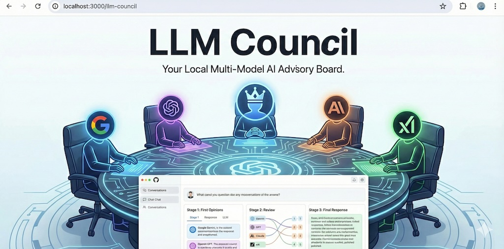

# ConsensusForge

[](https://opensource.org/licenses/MIT)
[]()
[]()
[](https://nodejs.org/)
[](https://python.org/)
[]()

> 🏛️ **An open-source framework that combines persistent, autonomous AI agents with an evolving multi-LLM consensus mechanism — reducing hallucinations, improving reliability, and getting smarter the longer it runs.**



---

## ✨ Features

- 🧠 **Multi-LLM Council** — Queries are sent to **Gemini**, **Grok**, and optionally **GPT-4o-mini** simultaneously. Each model responds independently, reviews & ranks peers anonymously, and a **Chairman LLM** synthesizes the best final answer.
- 🔄 **Automatic Evolution** — The system tracks which models perform best for which tasks and **automatically re-ranks the council** over time. Your agent literally gets smarter the longer it runs.
- 🤖 **Persistent 24/7 Agents** — Powered by **OpenClaw**, agents maintain long-term memory, execute skills, and stay alive across reboots. Not just a chatbot — a _living_ assistant.
- 💬 **Multi-Channel** — Connect via **Telegram**, Discord, WhatsApp, Web UI, or CLI. Talk to your council from anywhere.
- 🎯 **Hallucination Reduction** — Multiple models cross-check each other. Anonymized peer review means no model plays favorites. The result? **Significantly fewer hallucinations** without fine-tuning or massive RAG pipelines.
- 💸 **Zero / Minimal Cost** — Uses your existing API keys. Free-tier models via OpenRouter. Runs on your laptop or a ₹400/month VPS.
- 🔌 **Easy to Extend** — Add new models, skills, tools, and channels with minimal code.

---

## 🎯 Why ConsensusForge?

| Problem | ConsensusForge Solution |
|---|---|
| Single LLMs hallucinate | **Multi-model consensus** cross-checks every answer |
| Chatbots forget context | **Persistent agents** with long-term memory via OpenClaw |
| AI quality degrades for niche tasks | **Automatic evolution** learns which models excel at what |
| Running LLMs is expensive | **Free/minimal-cost** models + local execution |
| Hard to integrate into daily life | **Telegram-first** design — message your agent like a friend |

### 🎯 Target Use Cases

- 📈 **Personal Finance Watcher** — NSE/Sensex tracking, market alerts, portfolio analysis
- 📚 **Long-term Research Assistant** — Sustained research with fact-checking across sources
- ✍️ **Automated Content Generator** — Blog posts, reports, summaries with built-in verification
- 🏠 **Home Automation / Knowledge Manager** — Personal PKM with AI-powered organization
- 🎓 **Domain-Specific Bots** — Education tutors, coding helpers, travel planners

---

## 📊 Architecture

```
[User Interfaces]
   ↕ (Telegram / WhatsApp / Web / CLI)
[ConsensusForge Gateway / Agent Runtime]
   ↕
[Persistent Agent Layer]                  ← OpenClaw (state, skills, memory, channels)
   ↕
[Decision Engine]                         ← Consensus Core (multi-LLM)
   ├── LLM 1: Gemini
   ├── LLM 2: Grok
   └── (optional) LLM 3: OpenAI GPT-4o-mini
   ↕
[History & Evolution Module]
   → SQLite → Analyze performance → Update council config (model ranking, weights)
   ↕
[Tools / Skills / External Integrations]
   → Web search, file ops, APIs, calendars, etc.
```


### 🧩 Core Components

| Component | Technology | Role |
|---|---|---|
| **Runtime** | OpenClaw (Node.js) | Persistent agents, skills system, 24/7 execution |
| **Consensus Core** | Custom Python (inspired by [karpathy/llm-council](https://github.com/karpathy/llm-council)) | Calls multiple LLMs, orchestrates review & synthesis |
| **Model Providers** | Google Gemini API + xAI Grok API (+ optional OpenAI) | Diverse, high-quality LLM opinions |
| **Evolution** | Rule-based / statistical re-ranking | Auto-improves council composition from history |
| **Storage** | SQLite + JSON | Logs, agent memory, consensus history |
| **Interfaces** | OpenClaw built-in channels | Telegram (recommended), Discord, Web |

### 🔄 The 3-Stage Council Process

```
┌─────────────────────────────────────────────────┐
│  Stage 1: First Opinions                        │
│  → Each LLM responds independently to the query │
├─────────────────────────────────────────────────┤
│  Stage 2: Peer Review                           │
│  → Each LLM reviews & ranks anonymized          │
│    responses (no playing favorites)              │
├─────────────────────────────────────────────────┤
│  Stage 3: Chairman Synthesis                    │
│  → Designated Chairman compiles the best final  │
│    answer from all responses + evaluations       │
└─────────────────────────────────────────────────┘
```

---

## 🚀 Quick Start (5 minutes)

Get ConsensusForge running with the **web interface** in 5 minutes:

### Prerequisites

- **Node.js 18+** & npm
- **Python 3.10+** & [uv](https://docs.astral.sh/uv/)
- **Git**

### Steps

**1. Clone the repo**

```bash
git clone https://github.com/chaitanyakalra/consensus-forge.git
cd consensus-forge
```

**2. Install dependencies**

```bash
# Backend (Python)
uv sync

# Frontend (React)
cd frontend && npm install && cd ..
```

**3. Configure your API key**

Create a `.env` file in the project root:

```bash
OPENROUTER_API_KEY=sk-or-v1-your-key-here
```

> 💡 Get your free API key at [openrouter.ai](https://openrouter.ai/)

**4. Start the application**

```bash
# Option A: One command
./start.sh

# Option B: Run manually (two terminals)
# Terminal 1 — Backend
uv run python -m backend.main

# Terminal 2 — Frontend
cd frontend && npm run dev
```

**5. Open your browser**

Navigate to **http://localhost:5173** and ask your first question! 🎉

---

## 📖 Full Build Guide

For a deeper understanding or custom deployment, follow the **5-phase build guide** below.

### Phase 1 — Environment Setup _(30–60 min)_

```bash
# 1. Install prerequisites
#    Node.js 18+, Python 3.10+, Git

# 2. Install OpenClaw globally
npm install -g openclaw

# 3. Onboard OpenClaw
openclaw onboard
#    → Choose "Custom Provider" (we override the LLM)
#    → Select "Telegram" channel → create bot via @BotFather → paste token
#    → Skip LLM provider for now

# 4. Create project folder
mkdir consensus-forge && cd consensus-forge

# 5. (Optional) Clone llm-council for inspiration
git clone https://github.com/karpathy/llm-council.git council-base
cd council-base && pip install -r requirements.txt && cd ..
```

### Phase 2 — Build the Consensus Core _(Python – 2–4 hours)_

Create `council.py` — the heart of the multi-LLM decision engine:

```python
import os
import json
from google import genai                           # pip install google-generativeai
from xai_sdk import Client as GrokClient           # pip install xai-sdk
from openai import OpenAI                          # pip install openai

# Load keys from .env or environment
GEMINI_KEY = os.getenv("GEMINI_API_KEY")
GROK_KEY   = os.getenv("GROK_API_KEY")
OPENAI_KEY = os.getenv("OPENAI_API_KEY")

genai.configure(api_key=GEMINI_KEY)
grok_client = GrokClient(api_key=GROK_KEY)
openai_client = OpenAI(api_key=OPENAI_KEY)

DEFAULT_COUNCIL = [
    {"name": "gemini", "model": "gemini-1.5-flash"},
    {"name": "grok",   "model": "grok-beta"},
    # {"name": "gpt",  "model": "gpt-4o-mini"}   # uncomment when wanted
]

def call_llm(model_info, prompt):
    name = model_info["name"]
    if name == "gemini":
        model = genai.GenerativeModel(model_info["model"])
        resp = model.generate_content(prompt)
        return resp.text
    elif name == "grok":
        chat = grok_client.chat.create(model=model_info["model"])
        chat.append({"role": "user", "content": prompt})
        resp = chat.complete()
        return resp.content
    elif name == "gpt":
        resp = openai_client.chat.completions.create(
            model=model_info["model"],
            messages=[{"role": "user", "content": prompt}]
        )
        return resp.choices[0].message.content
    return "Error: unknown model"

def run_council(query, council=DEFAULT_COUNCIL, use_third=False):
    responses = []
    active = council if not use_third else council + [council[2]] if len(council) > 2 else council

    for model in active:
        try:
            answer = call_llm(model, query)
            responses.append({"model": model["name"], "answer": answer})
        except Exception as e:
            responses.append({"model": model["name"], "answer": f"Error: {str(e)}"})

    # Synthesis: combine all responses for the chairman
    combined = "\n\n".join([f"[{r['model']}]: {r['answer']}" for r in responses])
    chairman_prompt = f"Review these answers and produce the best final response:\n\n{combined}"

    # Use Gemini as chairman (cheap & fast)
    final = call_llm({"name": "gemini", "model": "gemini-1.5-flash"}, chairman_prompt)

    return {"query": query, "responses": responses, "final": final}

# CLI testing
if __name__ == "__main__":
    result = run_council("What is the current status of Indian stock market?")
    print(json.dumps(result, indent=2))
```

Install dependencies:

```bash
pip install google-generativeai xai-sdk openai python-dotenv
```

Create your `.env`:

```bash
GEMINI_API_KEY=your-key-here
GROK_API_KEY=your-key-here
OPENAI_API_KEY=your-key-here   # optional
```

### Phase 3 — Integrate into OpenClaw _(Node.js – 2–4 hours)_

**Create the bridge script** `call_council.js`:

```javascript
const { exec } = require('child_process');
const util = require('util');
const execPromise = util.promisify(exec);

async function runCouncil(query) {
  try {
    const cmd = `python3 council.py --query "${query.replace(/"/g, '\\"')}"`;
    const { stdout } = await execPromise(cmd, { cwd: '/path/to/consensus-forge' });
    return JSON.parse(stdout);
  } catch (err) {
    return { error: err.message };
  }
}

module.exports = { runCouncil };
```

**Create the OpenClaw skill** at `~/.openclaw/skills/consensus.md`:

```markdown
# ConsensusForge Skill

Description: Run multi-LLM consensus for important decisions
Trigger: when asked to analyze, decide, summarize uncertain info,
         or command contains "council" / "verify"

Steps:
1. Extract the decision/query from user message
2. Call Python council script: python3 /path/to/consensus-forge/council.py --query "{query}"
3. Parse JSON output
4. Return final consensus + brief explanation of votes
```

**Modify OpenClaw agent logic** (custom `SOUL.md` or middleware) to use the consensus skill for analysis tasks.

### Phase 4 — Add Evolution _(1–2 hours)_

Create `evolve.py` — runs periodically via cron or OpenClaw scheduler:

```python
# Simple version: count how often each model was closest to final answer
# Later: add user thumbs-up/down feedback from Telegram
```

The evolution module analyzes consensus history in SQLite and **automatically re-ranks models** based on performance patterns.

### Phase 5 — Testing & Deployment

```bash
# Test via Telegram
"Use council to analyze Nifty 50 trend"

# Deploy options
# Option A: Run on VPS (DigitalOcean ₹400/month)
# Option B: Run on home PC with PM2
pm2 start start.sh --name consensus-forge

# Option C: Docker (recommended for sandboxing)
docker-compose up -d
```

> ⚠️ **Security**: Sandbox your agents! Docker is strongly recommended for production.

---

## 🛠 Technology Stack

| Layer | Technology | Cost | Why Chosen |
|---|---|---|---|
| **Agent Runtime** | OpenClaw (npm package) | Free | Persistent agents, skills, channels |
| **Language** | Node.js (main) + Python (council) | Free | OpenClaw is Node, council easier in Python |
| **LLMs** | Gemini API + Grok API (+ optional OpenAI) | Your existing keys | Fast, strong, diverse opinions |
| **Consensus Logic** | Custom + inspired by [llm-council](https://github.com/karpathy/llm-council) | Free | Multi-LLM review & synthesis |
| **Database** | SQLite | Free | Lightweight, local |
| **Communication** | Telegram Bot (via OpenClaw) | Free | Easiest persistent interface |
| **Backend** | FastAPI (Python 3.10+), async httpx | Free | High-performance async API |
| **Frontend** | React + Vite, react-markdown | Free | Fast dev server, rich rendering |
| **Optional Extras** | Docker (sandbox), PM2 (process mgmt) | Free | Security & reliability |

---

## 📸 Screenshots / Demo

> Screenshots coming soon! Here's what to expect:

| Screenshot | Description |
|---|---|
|  | **Council Web Interface** — ChatGPT-like UI showing the multi-LLM tab view with individual model responses and the synthesized final answer |
|  | **Peer Review Stage** — Anonymized peer rankings where each model evaluates the others' responses with aggregate scoring |
|  | **Telegram Integration** — The 24/7 persistent agent responding to queries via Telegram with council-powered answers |

---

## 🗺️ Roadmap

- [x] Multi-LLM Consensus Core (Gemini + Grok council)
- [x] 3-Stage Pipeline (Respond → Review → Synthesize)
- [x] Web Interface (React + Vite)
- [x] OpenClaw Integration for persistent agents
- [x] Telegram channel support
- [ ] 👍 User feedback loop (thumbs up/down in Telegram)
- [ ] 🧮 Advanced synthesis (LLM ranker + weighted voting)
- [ ] 🔀 Auto-switch council based on task type
- [ ] 🌐 Publish to GitHub with CI/CD
- [ ] 🏠 Add local models ([Ollama](https://ollama.ai/)) as free fallback
- [ ] 📊 Dashboard for council performance analytics
- [ ] 🔐 Docker-based sandboxed execution
- [ ] 📱 WhatsApp & Discord channel integrations

---

## 🤝 Contributing

Contributions are welcome! ConsensusForge is an open-source project and we'd love your help.

1. **Fork** the repository
2. **Create** a feature branch (`git checkout -b feature/amazing-feature`)
3. **Commit** your changes (`git commit -m 'Add amazing feature'`)
4. **Push** to the branch (`git push origin feature/amazing-feature`)
5. **Open** a Pull Request

### Good First Issues

- Add support for a new LLM provider
- Improve the chairman synthesis prompt
- Add unit tests for the ranking parser
- Create Docker Compose configuration
- Build the evolution module (`evolve.py`)

---

## 📄 License

This project is licensed under the **MIT License** — see the [LICENSE](LICENSE) file for details.

```
MIT License — February 2026
Copyright (c) 2026 Chaitanya
```

---

## ❤️ Acknowledgments

- **[Andrej Karpathy](https://github.com/karpathy)** — for the original [llm-council](https://github.com/karpathy/llm-council) concept and inspiration. ConsensusForge's multi-LLM review & synthesis pipeline is built on this brilliant idea.
- **[OpenClaw](https://openclaw.com/)** — the powerful runtime that makes persistent, 24/7 AI agents possible with built-in skills, memory, and channel support.
- **[Google Gemini](https://ai.google.dev/)** — fast, capable, and cost-effective. Our default Chairman LLM.
- **[xAI Grok](https://x.ai/)** — bold, unfiltered perspectives that strengthen council debate.
- **[OpenRouter](https://openrouter.ai/)** — unified API access to dozens of LLMs with free-tier models.
- **[Vite](https://vitejs.dev/)** + **[React](https://react.dev/)** — blazing-fast frontend tooling.
- **[FastAPI](https://fastapi.tiangolo.com/)** — high-performance async Python backend.

---

<p align="center">
  <strong>Start small → Get Gemini + Grok working → Add evolution → Polish interface</strong>
  <br><br>
  Made with ❤️ in Gurugram, India
</p>
